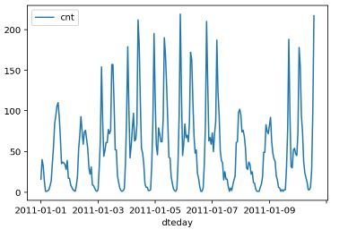
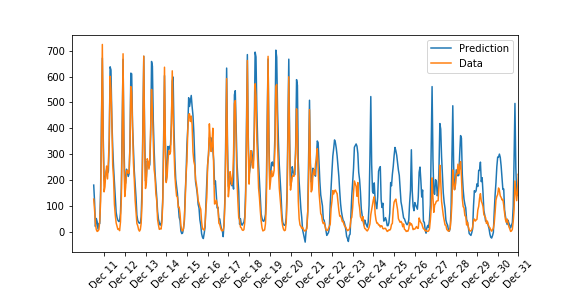
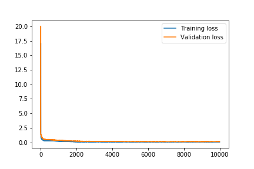

#  Bikesharing-project

A scratch Neural network implementation to predict bike sharing patterns.

## Details
**About**:    Bike sharing systems are becoming new generation of traditional bike rental services. By using Sharing system the user would get easily rent bike in any location and return in any another location. This bike sharing system helps lot due to its important role in making enviroment and health better. 

**Implementation**:  It was a hard problem to predict bike sharing patterns through the use of traditional machine learning techniques.  But thanks to multi-layer preceptron (Neural networks) it is now a simple problem to get predict future data given past data.  

This Nework uses 18 hidden nodes and 1 output node. Their best hyperparameters are below:
> - iterations = 10000
> - learning_rate = 0.6
> - hidden_nodes = 18
> - output_nodes = 1

Its training accuracy can be increased much by more iteration, However it may not be able to fit the test data.  By using above hyperparameters, my model is able to get

> Training loss: 0.050 ... Validation loss: 0.124

**Visualizing data**: 
Below is a plot showing the number of bike riders over the first 10 days or so in the data set. (Some days don't have exactly 24 entries in the data set, so it's not exactly 10 days.) You can see the hourly rentals here. 

**Prediction**: 
Our model is absolutely working fantastic in outer training data, However we can see little overfitting in recent data.Upto Dec 11 to Dec 21 , Our model is best both for training and validating. But after Dec 21, It failed, It overfit the data. May be different political ,economic reasons. The data after Dec 21 starts overfit, as our model was trained to work on previous seen, but in this case , due to mentioned reasons It failed to fit recent data. 

Here we could see how losses decreases for the number of iterations.

**Further Imporovements**: 
some overfitting can be mitigated by having more data for train, applying regularization techniques, running less epochs or taking lower learning rate.

**References**
- This project is done with udacity [deep learning nanodegree](https://classroom.udacity.com/nanodegrees/nd101 "deep learning nanodegree").
- The data comes from the [UCI Machine Learning Database ](https://archive.ics.uci.edu/ml/datasets/Bike+Sharing+Dataset "UCI Machine Learning Database ")         
